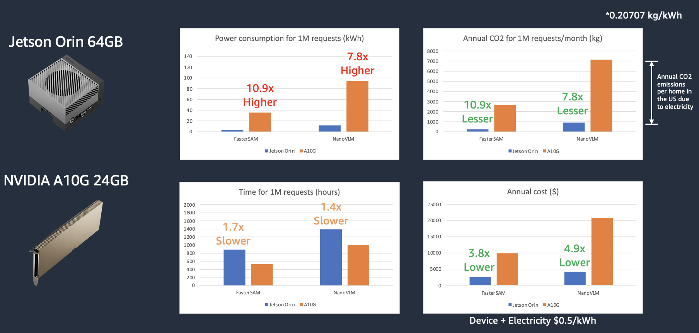

# GenAI at Edge
This repository demonstrates the use of AWS IoT GreengrassV2 for running Generative AI models on Edge devices specifically NVIDIA Jetson Devices. The work here focuses on running large models on edge devices for a cheaper, faster, and efficient solution. The repository using AWS IoT GreengrassV2 on the edge device to communicate between AWS services and device. Here, the models once hosted on the edge device which is conncted to a camera, can accept text prompts to capture images and respond based on queries asked and chosen model. The query to the device and the response back to cloud is being done using MQTT protocol.

Currently the sample supports 2 types of GenAI models:

1. NanoVLM - A Visual Language Models used for Text+Image to Text which is based on [Jetson AI Lab NanoVLM Example](https://www.jetson-ai-lab.com/tutorial_nano-vlm.html).
2. FasterSAM - A Segment Anything Model variant of [FastSAM](https://github.com/CASIA-IVA-Lab/FastSAM) used for segmenting pixels based on text queries.

Note: This is specifically for NVIDIA Jetson like edge devices and have been tested on NVIDIA Jetson Orin 8/16/32 GB and Jetson Orin Nano.


## Setup:
- Requirements:
    - NVIDIA Jetson device with >32GB free memory
    - Local PC or EC2 Instance with Ubuntu ARM64v

- Models used:
    1. NanoVLM:
        - [openai/clip-vit-large-patch14-336](https://huggingface.co/openai/clip-vit-large-patch14-336) - MIT-0 License
        - [Efficient-Large-Model/VILA-2.7b](https://huggingface.co/Efficient-Large-Model/VILA-2.7b) - Apache 2.0 License
    2. FasterSAM:
        - [ultralytics/yolov8s-seg](https://huggingface.co/An-619/FastSAM) - Apache 2.0 License
        - [jinaai/clip-models/ViT-B-32-textual](https://huggingface.co/jinaai/clip-models) - Apache 2.0 License
        - [jinaai/clip-models/ViT-B-32-visual](https://huggingface.co/jinaai/clip-models) - Apache 2.0 License

- Prerequisites:
    - [Provision Edge device for AWS IoT GreengrassV2](#how-to-setup-edge-device-with-iot-greengrass-v2)
    - [Setup Local PC or EC2 for docker build and AWS credentials](#how-to-build-jetson-docker-and-host-on-ecr)
    - [Setup Local PC or EC2 for Greengrass CLI](#how-to-buildpublish-greengrassv2-component-and-create-deployment-on-edge-device)


## AWS Architecture

Follow these steps after edge device is provisioned for AWS IoT GreengrassV2:
1. Using Local PC or Amazon EC2 instance with Ubuntu and ARMv64 cloning the GitHub repository. Export desired environment variables:
    ```
    $ export AWS_ACCOUNT_NUM="ADD_ACCOUNT_NUMBER"
    $ export AWS_REGION="ADD_ACCOUNT_REGION"
    $ export AWS_REGION="ADD_REGION"
    $ export DEV_IOT_THING="NAME_OF_OF_THING"
    $ export DEV_IOT_THING_GROUP="NAME_OF_IOT_THING_GROUP"
    ```
2. Build a Jetson docker image published to Amazon ECR and GreengrassV2 components using GDK:
    - (a) Jetson docker image is on Amazon ECR
    - (b) GreengrassV2 components built/published and deployments published to AWS IoT Core and eventually to the Edge device
3. Edge device is provisioned for GreengrassV2 for the AWS Account and has the required GreengrassV2 components, namely:
    - com.aws.jetson.docker: This component downloads the Jetson Docker image from the image stored in ECR and runs it.
        - (com.greengrass.DockerApplicationManager)[https://docs.aws.amazon.com/greengrass/v2/developerguide/docker-application-manager-component.html]: The Docker application manager component enables AWS IoT Greengrass to download Docker images.
        - (com.greengrass.TokenExchangeService)[https://docs.aws.amazon.com/greengrass/v2/developerguide/token-exchange-service-component.html]: The token exchange service component provides AWS credentials that you can use to interact with AWS services in your custom components.
    - com.aws.edge.genai: This component is responsible for communicating between AWS IoT Core using MQTT and the `com.aws.jetson.docker` component using socket communication.
4. Working of different components on the device:
    - (a) `com.aws.jetson.docker` component runs the docker container and communicates using socket with the `com.aws.edge.genai` component.
    - (b) `com.aws.edge.genai` is responsbile to connect with camera and communicate between cloud and docker using MQTT and socket respectively for running inference and sending results to AWS IoT Core.
5. MQTT Commands to run VLM on edge:
    - (a) CAPTURE: Used to run an image capture on the device which will be sent to the right GenAI model as identified:
        ```
        {
            "event": "capture",
            "type": "nanovlm" / "fastersam"
        }
        ```
    - (b) TEXT: Prompts sent to the model for running inference and output response will be sent to the MQTT client:
        ```
        {
            "event": "text",
            "text": "Describe the scene" / "Segment trees and roads",
            "type": "nanovlm" / "fastersam"
        }
        ```
    - (c) RESET: Reset the image and the history:
        ```
        {
            "event": "reset",
            "type": "nanovlm" / "fastersam"
        }
        ```
6. Responses from the AWS IoT Core MQTT Client can be received and executed as required. For example, AWS IoT Rule can be used to redirect responses through AWS Lambda for visualization of results through an API GateWay connected to a Frontend UI. Examples of FrontEnd UI are shown [here](frontend).
    <p align="center">
        
        
    </p>

---

## How Tos:
### How to Setup Edge Device with IoT Greengrass V2?
- Use the [Blog](https://aws.amazon.com/blogs/iot/using-aws-iot-greengrass-version-2-with-amazon-sagemaker-neo-and-nvidia-deepstream-applications/) to provision an edge device like NVIDIA Jetson with IoT Greengrass V2. Also use [Docs](https://docs.aws.amazon.com/greengrass/v2/developerguide/run-docker-container.html) to configure docker related settings on the device.
- Alternatively, you can use the following script and run in the Edge Device:
    ```
    [On Edge Device]
    $ git clone https://github.com/aws-samples/genai-at-edge
    $ cd genai-at-edge/greengrass
    $ chmod u+x provisioning.sh
    $ ./provisioning.sh
    $ [Check Jetpack version of Jetson device] sudo apt-cache show nvidia-jetpack
    ```
    - The `provisioning.sh` script only works for Ubuntu based system.
    - It would prompt for AWS Credentials which can be bypassed if already configured by clicking Enter.
    - It would prompt for providing name of `IoT Thing` & `IoT Thing Group` and if not entered, would take default values.
    - Once completed, the `IoT Thing` and its `IoT Thing Group` would be available on the AWS Console.
### How to Build Jetson Docker and host on ECR?
    ```
    $ export ALGO_NAME="genai-at-edge"
    $ [For JetPack 5] docker pull dustynv/nano_llm:r35.4.1 && docker build -t ${ALGO_NAME} -f docker/Dockerfile.r35.4.1 .
    $ [For JetPack 6] docker pull dustynv/nano_llm:r36.2.0 && docker build -t ${ALGO_NAME} -f docker/Dockerfile.r36.2.0 .

    $ aws ecr get-login-password --region ${AWS_REGION} | docker login --username AWS --password-stdin ${AWS_ACCOUNT_NUM}.dkr.ecr.${AWS_REGION}.amazonaws.com
    $ (Once to create ECR Repository) aws ecr create-repository --repository-name ${ALGO_NAME}
    $ docker tag ${ALGO_NAME} ${AWS_ACCOUNT_NUM}.dkr.ecr.${AWS_REGION}.amazonaws.com/${ALGO_NAME}:latest"
    $ docker push ${AWS_ACCOUNT_NUM}.dkr.ecr.${AWS_REGION}.amazonaws.com/${ALGO_NAME}:latest"
    ```
### How to Build/Publish GreengrassV2 Component and Create Deployment on Edge device?
    ```
    $ python3 -m pip install -U git+https://github.com/aws-greengrass/aws-greengrass-gdk-cli.git@v1.2.0

    [Install jq for Linux]
    $ apt-get install jq

    [Install jq for Linux]
    $ brew install jq

    $ cd greengrass/
    $ chmod u+x deploy-gdk-build.sh
    $ ./deploy-gdk-build.sh

    [Upon request for options to build components, choose accordingly]
        Select update option:
        1. Update Component 1: EdgeGenAI
        2. Update Component 2: Jetson Docker
        3. Update All components (EdgeGenAI & Jetson Docker)
        Enter your choice (1/2/3):
    ```
### How to run a cleanup on the GreengrassV2 components and deployments?
    ```
    [Run the code as follows to cleanup]
    $ cd greengrass/
    $ python3 cleanup_gg.py
    ```

---

## Performance Evaluation between NVIDIA Jetson Orin 64GB and NVIDIA A10G 24GB:
<p align="center">
    
</p>

## Acknowledgment
This project is loosely based on Jetson Tutorials for GenAI like:
- https://www.jetson-ai-lab.com/tutorial_nano-vlm.html
- https://hub.docker.com/r/dustynv/nano_llm
- https://github.com/dusty-nv/NanoLLM
- https://github.com/CASIA-IVA-Lab/FastSAM

## License
MIT-0

## Security
See [CONTRIBUTING](CONTRIBUTING.md#security-issue-notifications) for more information.

## License
This library is licensed under the MIT-0 License. See the [LICENSE](LICENSE) file.

## Contributors
- [Romil Shah](mailto:rpshah@amazon.com)
- [Fabian Benitez-Quiroz](mailto:fabianbq@amazon.com)
